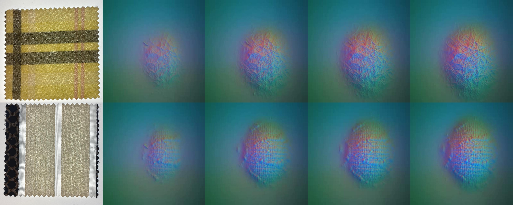

# 🧵 MLLM-Fabric: Multimodal LLM-Driven Robotic Framework for Fabric Sorting and Selection
[](https://github.com/limanwang/MLLM-Fabric)
[](./LICENSE)
[](https://www.youtube.com/watch?v=VeN7tr4-WvM)
[](https://arxiv.org/abs/2507.04351)
[](https://arxiv.org/abs/2507.04351) 
[](https://huggingface.co/datasets/EuniceF/MLLM-Fabric)
[](https://uyork-robotic-manipulation-lab.github.io/)


## 📄 Overview

This is the official repository for the paper:

> **MLLM-Fabric: Multimodal Large Language Model-Driven Robotic Framework for Fabric Sorting and Selection**  

Accepted to **IEEE Robotics and Automation Letters (RA-L)**

## 🏫 About This Work

This work is from the [Robot-Assisted Living LAboratory (RALLA)](https://uyork-robotic-manipulation-lab.github.io/) at the University of York, UK.

### 🧵 Fabric Dataset Overview
> The **MLLM-Fabric Dataset** is available on [HuggingFace](https://huggingface.co/datasets/EuniceF/MLLM-Fabric) — feel free to download and explore!

These images showcase fabric sample RGB and GelSight images from our dataset (including 220 different fabrics in total).

<p align="left">
  
</p>

<p align="left">
  
</p>


## 📄 Paper

You can read our full paper here:  
[MLLM‑Fabric: Multimodal Large Language Model‑Driven Robotic Framework for Fabric Sorting and Selection (arXiv 2507.04351)](https://arxiv.org/abs/2507.04351)

---


## 🧾 Abstract

**MLLM-Fabric** is a robotic framework that leverages **multimodal large language models (MLLMs)** for intelligent fabric sorting and selection. It integrates **vision, touch, and pressure** sensing on a multimodal robotic platform, trained via **supervised fine-tuning** and **explanation-guided distillation**.

We introduce a dataset of **220 fabrics** with RGB, visuotactile, and pressure data. Our model, **Fabric-Llama-90B**, significantly outperforms vision-language baselines in both **attribute ranking** and **selection accuracy**.

---


### 🤖 Real-World Demo

<p align="center">
  
</p>

---

### 🧠 System Architecture

<p align="center">
  
</p>

---

## 🎥 Video Demonstration

📺 [Click here to watch the video](https://www.youtube.com/watch?v=VeN7tr4-WvM)

<p align="center">
  <a href="https://www.youtube.com/watch?v=VeN7tr4-WvM">
    
  </a>
</p>

---


## 🏋️ Train

- 🔧 Code for training (now available!)

> ✅ We have uploaded the training code used for supervised fine-tuning.  
> It is based on the excellent [**Unsloth**](https://github.com/unslothai/unsloth) framework.  
> Special thanks to the Unsloth team for their powerful and efficient LLM training tools!  
> We highly recommend checking it out if you're working with LLM fine-tuning.

## 📜 License

This project is licensed under the **Apache 2.0 License** – see the [LICENSE](./LICENSE) file for details.

---

## 📬 Contact

For questions or collaboration opportunities, feel free to open an issue or reach out to the authors.

---

⭐️ If you find this work useful, please consider **starring** the repository to support us!

## 📚 Citation

```bibtex
@misc{wang2025mllmfabricmultimodallargelanguage,
      title={MLLM-Fabric: Multimodal Large Language Model-Driven Robotic Framework for Fabric Sorting and Selection}, 
      author={Liman Wang and Hanyang Zhong and Tianyuan Wang and Shan Luo and Jihong Zhu},
      year={2025},
      eprint={2507.04351},
      archivePrefix={arXiv},
      primaryClass={cs.RO},
      url={https://arxiv.org/abs/2507.04351}, 
}
